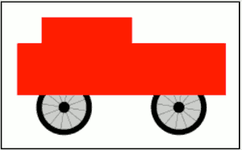
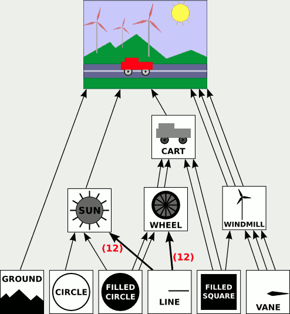
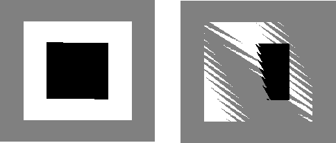
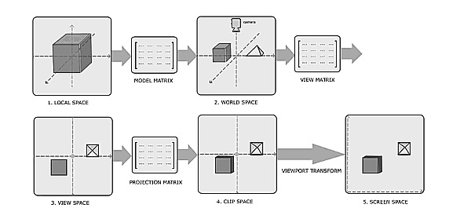
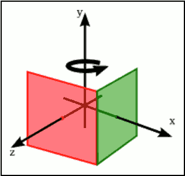
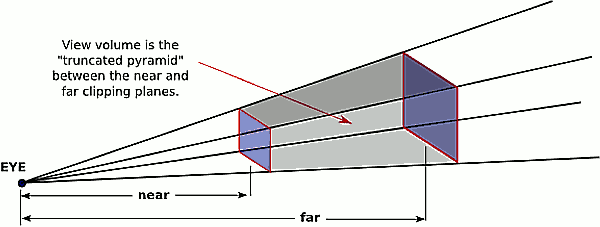
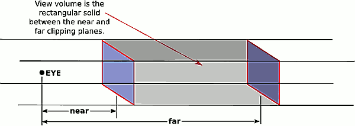
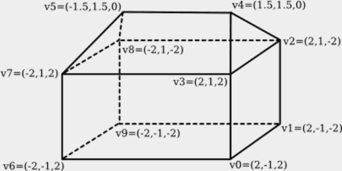
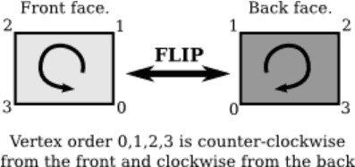

# Introduction to Compute Graphics

[website](http://math.hws.edu/graphicsbook/)

[course pdf](http://math.hws.edu/eck/cs424/downloads/graphicsbook-linked.pdf)

[labs used to teach course 2017](http://math.hws.edu/eck/cs424/index_f17.html)


In this book , will use a subset of OpenGL 1.1 to introduce the fundamental concepts of three-dimensional graphics. 


## Chapter 1 Introduction

## 1.2 Elements of 3D Graphics

 - geometric primitives
    - such as line, segments and triangles 
 - material
    - the properties that determine the intrinsic visual appearance of a surface.
    - Essentially, this means how the surface interacts with light that hits the surface.
    - can include a basic color as well as other properties such as shininess, roughness, and transparency.
 - texture
    - One of the most useful kinds of material property
    - Textures allow us to add detail to a scene without using a huge number of geometric primitives;


## 1.3 Hardware and Software
 
 - OpenGl
    - designed as a "client/server" system
    - communicating from the client (the CPU) to the server (the GPU)  are very slow
        - One approach is to store information in the GPU's memory.  
            - If some data is going to be used several times, it can be transmitted to the GPU once and stored in memory there.
        - Another approach is to try to decrease the number of OpenGL commands that must be transmitted to the GPU to draw a given image.
            - in OpenGL 1.1, all the data for the object would be loaded into arrays , which could then be sent in a single step to the GPU. 
            - Unfortunately, the data would have to be retransmitted each time the object was drawn.
            - This was fixed in OpenGL 1.5 with *Vertex Buffer Objects* .  A VBO is a block of memory in the GPU that can store the coordinates or attribute values for a set of vertices.

    - OpenGL 1.1 introduced *texture objects to* make it possible to store several images on the GPU for use as textures. 
    - OpenGL was a giant machine, but still not pleasing everyone. The real solution was to make the machine **programmable**.
        - With OpenGL 2.0, it became possible to write programs to be executed as part of the graphical computation in the GPU. 
        - The programs are called *shaders*.
    - In OpenGL 3.0, the usual per-vertex and per-fragment processing was deprecated. 
    - And in OpenGL 3.1, it was removed from the OpenGL standard, although it is still present as an optional extension.
    - In practice, all the original features of OpenGL are still supported in desktop versions of OpenGL and will probably continue to be available in the future. 
        - On the embedded system side, however, with OpenGL ES 2.0 and later, the use of shaders is mandatory, and a large part of the OpenGL 1.1 API has been completely removed. 
        - WebGL, the version of OpenGL for use in web browsers, is based on OpenGL ES 2.0, and it also requires shaders to get anything at all done.
    - Nevertheless, we will begin our study of OpenGL with version 1.1. Most of the concepts and many of the details from that version are still relevant, and it offers an easier entry point for someone new to 3D graphics programming.

 - OpenGL shaders are written in GLSL (OpenGL Shading Language).
    - We will spend some time later in the course studying GLSL ES 1.0, the version used with WebGL 1.0 and OpenGL ES 2.0. 
    - GLSL uses a syntax similar to the C programming language.

---

# Chapter 2 Two-Dimensional Graphics

## 2.1 Pixels, Coordinates, and Colors

 - *Antialiasing* is a term for techniques that are designed to mitigate the effects of aliasing. 
    - The idea is that when a pixel is only partially covered by a shape, the color of the pixel should be a mixture of the color of the shape and the color of the background. 
    - In practice, calculating this area exactly for each pixel would be too difficult, so some approximate method is used.


## Section 2.2 Shapes

 - Line
    - A simple one-pixel-wide line segment, without antialiasing, is the most basic shape.
        - One of the first computer graphics algorithms,  **Bresenham's** algorithm for line drawing, implements a very efficient procedure for doing so. 
    - In any case, lines are typically more complicated. Antialiasing is one complication. Line width is another. A wide line might actually be drawn as a rectangle.
    
## Section 2.3 Transforms

### 2.3.8  Matrices and Vectors

 - If we want to apply a scaling followed by a rotation to the point v = (x,y), we can compute either R(Sv) or (RS)v. 
 - Translation is not a linear transformation. 
    - To bring translation into this framework (rotate and scale) , we do something that looks a little strange at first: Instead of representing a point in 2D as a pair of numbers (x,y), we represent it as the triple of numbers (x,y,1). 
    - It then turns out that we can then represent rotation, scaling, and translation—and hence any affine transformation—on 2D space as multiplication by a 3-by-3 matrix.
    - The matrices that we need have a bottom row containing (0,0,1). Multiplying (x,y,1) by such a matrix gives a new vector (x1,y1,1).


## 2.4 Hierarchical Modeling 

In this section, we look at how complex scenes can be built from very simple shapes. The key is hierarchical structure.

### 2.4.1  Building Complex Objects
 
 - When drawing an object, use the coordinate system that is most natural for the object.
 - Usually, we want an object in its natural coordinates to be centered at the origin, (0,0), or at least to use the origin as a convenient reference point. 
    - Then, to place it in the scene, we can use a scaling transform, followed by a rotation, followed by a translation to set its size, orientation, and position in the scene. 
    - Recall that transformations used in this way are called  *modeling transformations*.
    - The transforms are often applied in the order scale, then rotate, then translate, because scaling and rotation leave the reference point, (0,0), fixed.
        - in the code, the translation would come first, followed by the rotation and then the scaling:  TRS
        - Modeling transforms are not always composed in this order, but it is the most common usage.
 - The modeling transformations that are used to place an object in the scene should not affect other objects in the scene. 
    - we can save the current transformation before starting work on the object and restore it afterwards. 
    - but let's suppose here that there are subroutines saveTransform() and restoreTransform() for performing those tasks.

```
saveTransform()
translate(dx,dy) // move object into position
rotate(r)        // set the orientation of the object
scale(sx,sy)     // set the size of the object
     .
     .  // draw the object, using its natural coordinates
     .
restoreTransform()
```

 - Note that we don't know and don't need to know what the saved transform does. 
    - The modeling transform moves the object from its natural coordinates into its proper place in the scene. 
    - Then on top of that, a coordinate transform that is applied to the scene as a whole would carry the object along with it.
 - Let's look at a little example. Suppose that we want to draw a simple 2D image of a cart with two wheels.
    - 
    - The wheel has radius 1.
    - The rectangular body of the cart has width 6 and height 2.
        - it is convenient use the midpoint of the base of the large rectangle as the reference point.
        - assume that the positive direction of the y-axis points upward, which is the common convention in mathematics.
        - so the coordinates of the lower left corner of the rectangle are (-3,0)
    - In wheel's coordinate system, the wheel is centered at (0,0) and has radius 1.
 - Here is pseudocode for a subroutine that draws the cart in its own coordinate system:

```
subroutine drawCart() :
    saveTransform()       // save the current transform
    translate(-1.65,-0.1) // center of first wheel will be at (-1.65,-0.1)
    scale(0.8,0.8)        // scale to reduce radius from 1 to 0.8
    drawWheel()           // draw the first wheel
    restoreTransform()    // restore the saved transform
    saveTransform()       // save it again
    translate(1.5,-0.1)   // center of second wheel will be at (1.5,-0.1)
    scale(0.8,0.8)        // scale to reduce radius from 1 to 0.8
    drawWheel(g2)         // draw the second wheel
    restoreTransform()    // restore the transform
    setDrawingColor(RED)  // use red color to draw the rectangles
    fillRectangle(-3, 0, 6, 2)      // draw the body of the cart
    fillRectangle(-2.3, 1, 2.6, 1)  // draw the top of the cart
```
     
 - Once we have this cart-drawing subroutine, we can use it to add a cart to a scene. When we do this, we apply another modeling transformation to the cart as a whole. Indeed, we could add several carts to the scene, if we wanted, by calling the drawCart subroutine several times with different modeling transformations.
 - Building up a complex scene out of objects is similar to building up a complex program out of subroutines.
 
### 2.4.2  Scene Graphs
 
 - Logically, the components of a complex scene form a structure. 
    - In this structure, each object is associated with the sub-objects that it contains. 
    - If the scene is hierarchical, then the structure is hierarchical.
    - This structure is known as a **scene graph**.   
    - A scene graph is a tree-like structure, with the root representing the entire scene, the children of the root representing the top-level objects in the scene, and so on.



 - In this drawing, a single object can have several connections to one or more parent objects. 
    - Each connection represents one occurrence of the object in its parent object.
    - Each arrow in the picture can be associated with a modeling transformation that places the sub-object into its parent object. 
    - When an object contains several copies of a sub-object, each arrow connecting the sub-object to the object will have a different associated modeling transformation. 
        - The object is the same for each copy; only the transformation differs.
 - When implementing a scene graph as a data structure made up of objects, a decision has to be made about how to handle transforms.
    - One option is to allow transformations to be associated with any node in the scene graph. 
 - A scene graph is actually an example of a "directed acyclic graph" or "dag."


### 2.4.3  The Transform Stack


## 2.6 HTML Canvas Graphics

### 2.6.1  The 2D Graphics Context

```js
<canvas width="800" height="600" id="theCanvas"></canvas>
```

 - The *id* is an identifier that can be used to refer to the canvas in JavaScript.
 - To draw on a canvas, you need a graphics context. 
    - A graphics context is an object that contains functions for drawing shapes. 

```js
canvas = document.getElementById("theCanvas");
graphics = canvas.getContext("2d");
```

 - Typically, you will store the canvas graphics context in a global variable and use the same graphics context throughout your program. 

```js
<!DOCTYPE html>
<html>
<head>
<title>Canvas Graphics</title>
<script>
    var canvas;    // DOM object corresponding to the canvas
    var graphics;  // 2D graphics context for drawing on the canvas

    function draw() {
           // draw on the canvas, using the graphics context
        graphics.fillText("Hello World", 10, 20);
    }

    function init() {
        canvas = document.getElementById("theCanvas");
        graphics = canvas.getContext("2d");
        draw();  // draw something on the canvas
    }
</script>
</head>
<body onload="init()">
    <canvas id="theCanvas" width="640" height="480"></canvas>
</body>
</html>
```

 - Find more canvans2d example  in http://math.hws.edu/graphicsbook/c2/s6.html


### 2.6.2  TODO

# Chapter 3 OpenGL 1.1: Geometry

## 3.1 Shapes and Colors in OpenGL 1.1

### 3.1.1  OpenGL Primitives

 - OpenGL can draw only a few basic shapes, including points, lines, and triangles. 
    - There is no built-in support for curves or curved surfaces; they must be approximated by simpler shapes. 
 - A primitive in OpenGL is defined by its vertices.
 - Let's jump right in and see how to draw a triangle. It takes a few steps:

```c
glBegin(GL_TRIANGLES);
glVertex2f( -0.7, -0.5 );
glVertex2f( 0.7, -0.5 );
glVertex2f( 0, 0.7 );
glEnd();
```

 - Vertices must be specified between calls to glBegin and glEnd.
 - I should note that these functions actually just send commands to the GPU.
    - OpenGL can save up batches of commands to transmit together, and the drawing won't actually be done until the commands are transmitted.
    - To ensure that that happens, the function glFlush() must be called.
    - In some cases, this function might be called automatically by an OpenGL API, but you might well run into times when you have to call it yourself.
 - For OpenGL, vertices have three coordinates. The function glVertex2f specifies the x and y coordinates of the vertex, and the z coordinate is set to zero. 
 - There is also a function glVertex3f that specifies all three coordinates.
    - The "2" or "3" in the name tells how many parameters are passed to the function. 
    - The "f" at the end of the name indicates that the parameters are of type float.
 - OpenGL 1.1 has ten kinds of primitive.
    - Seven of them still exist in modern OpenGL; the other three have been dropped.
 - The simplest primitive is **GL_POINTS**,  which simply renders a point at each vertex of the primitive. 
    - By default, a point is rendered as a single pixel. The size of point primitives can be changed by calling
        - `glPointSize(size);`
    - where the parameter, size, is of type float and specifies the diameter of the rendered point, in pixels. 
    - By default, points are squares. You can get circular points by calling
        - `glEnable(GL_POINT_SMOOTH);`
 - The functions glPointSize and glEnable change the OpenGL "state." 
    - The state includes all the settings that affect rendering. 
    - The functions glEnable and glDisable can be used to turn many features on and off. 
    - In general, the rule is that any rendering feature that requires extra computation is turned off by default.
 - There are three primitives for drawing line segments: **GL_LINES**, **GL_LINE_STRIP**, and **GL_LINE_LOOP**. 
    - 
    - The width for line primitives can be set by calling glLineWidth(width). 
        - The line width is always specified in pixels. It is **not** subject to scaling by transformations.
 - There are three of triangle primitives: **GL_TRIANGLES**, **GL_TRIANGLE_STRIP**, and **GL_TRIANGLE_FAN**.
    - 
 - The three remaining primitives, which have been removed from modern OpenGL, are **GL_QUADS**, **GL_QUAD_STRIP**, and **GL_POLYGON**. 
 

### 3.1.2  OpenGL Color

 - `glColor*`
 - You can add a fourth component to the color by using *glColor4f()*. 
    - The fourth component, known as alpha, is not used in the default drawing mode, 
    - You need two commands to turn on transparency:

```
glEnable(GL_BLEND);   // enables use of the alpha component. 
glBlendFunc(GL_SRC_ALPHA, GL_ONE_MINUS_SRC_ALPHA);
```

 - Here are some examples of commands for setting drawing colors in OpenGL:

```
glColor3f(0,0,0);         // Draw in black.

glColor3f(1,1,1);         // Draw in white.

glColor3f(1,0,0);         // Draw in full-intensity red.

glColor3ub(1,0,0);        // Draw in a color just a tiny bit different from
                          // black.  (The suffix, "ub" or "f", is important!)

glColor3ub(255,0,0);      // Draw in full-intensity red.

glColor4f(1, 0, 0, 0.5);  // Draw in transparent red, but only if OpenGL
                          // has been configured to do transparency.  By
                          // default this is the same as drawing in plain red.
```

 - Using any of these functions sets the value of a "current color," which is part of the OpenGL state. 
    - When you generate a vertex with one of the `glVertex*` functions, the current color is saved along with the vertex coordinates, as an *attribute* of the vertex. 
    - Colors are associated with individual vertices, not with complete shapes. 
    - By changing the current color between calls to glBegin() and glEnd(), you can get a shape in which different vertices have different color attributes. 

```c
glBegin(GL_TRIANGLES);
glColor3f( 1, 0, 0 ); // red
glVertex2f( -0.8, -0.8 );
glColor3f( 0, 1, 0 ); // green
glVertex2f( 0.8, -0.8 );
glColor3f( 0, 0, 1 ); // blue
glVertex2f( 0, 0.9 );
glEnd();
```

 - Note that when drawing a primitive, you do not need to explicitly set a color for each vertex, as was done here. If you want a shape that is all one color, you just have to set the current color once, before drawing the shape (or just after the call to glBegin(). 

```c
glColor3ub(255,255,0);  // yellow
glBegin(GL_TRIANGLES);
glVertex2f( -0.5, -0.5 );
glVertex2f( 0.5, -0.5 );
glVertex2f( 0, 0.5 );
glEnd();
```

---

 - A common operation is to clear the drawing area by filling it with some background color. 
    - It is be possible to do that by drawing a big colored rectangle, but OpenGL has a potentially more efficient way to do it. 
    - The function `glClearColor(r,g,b,a);`  sets up a color to be used for clearing the drawing area. 
        - This only sets the color; the color isn't used until you actually give the command to clear the drawing area.
        - The default clear color is all zeros, that is, black with an alpha component also equal to zero. 
    - The command to do the actual clearing is: `glClear( GL_COLOR_BUFFER_BIT );`
        - The correct term for the *drawing area* is  **color buffer**.
        - OpenGL uses several buffers in addition to the color buffer. 
        - The glClear command can be used to clear several different buffers at the same time, which can be more efficient than clearing them separately since the clearing can be done in parallel. For example: 
        - `glClear( GL_COLOR_BUFFER_BIT | GL_DEPTH_BUFFER_BIT );`
        - This is the form of glClear that is generally used in 3D graphics, where the depth buffer plays an essential role.
        - For 2D graphics ,  the appropriate parameter for glClear is just GL_COLOR_BUFFER_BIT.

### 3.1.3  glColor and glVertex with Arrays

 - There are also versions that let you place all the data for the command in a single array parameter. 
    - The names for such versions end with "v". 
    - For example: `glColor3fv, glVertex2iv, glColor4ubv, and glVertex3dv`. 
    - The "v" actually stands for "vector," meaning essentially a one-dimensional array of numbers. 
    - For example, in the function call `glVertex3fv(coords)`, coords would be an array containing at least three floating point numbers.
 - The existence of array parameters in OpenGL forces some differences between OpenGL implementations in different programming languages. 

```c
// c , draw a rectangle
float coords[] = { -0.5, -0.5,  0.5, -0.5,  0.5, 0.5,  -0.5, 0.5 };

glBegin(GL_TRIANGLE_FAN);
glVertex2fv(coords);      // Uses coords[0] and coords[1].
glVertex2fv(coords + 2);  // Uses coords[2] and coords[3].
glVertex2fv(coords + 4);  // Uses coords[4] and coords[5].
glVertex2fv(coords + 6);  // Uses coords[6] and coords[7].
glEnd();
```

```java
// java, draw a rectangle
float[] coords = { -0.5F, -0.5F,  0.5F, -0.5F,  0.5F, 0.5F,  -0.5F, 0.5F };

gl2.glBegin(GL2.GL_TRIANGLES);
gl2.glVertex2fv(coords, 0);  // Uses coords[0] and coords[1].
gl2.glVertex2fv(coords, 2);  // Uses coords[2] and coords[3].
gl2.glVertex2fv(coords, 4);  // Uses coords[4] and coords[5].
gl2.glVertex2fv(coords, 6);  // Uses coords[6] and coords[7].
gl2.glEnd();
```

### 3.1.4  The Depth Test

 - The depth test solves the hidden surface problem no matter what order the objects are drawn in, so you can draw them in any order you want!
    - The term "depth" here has to do with the distance from the viewer to the object. 
    - Objects at greater depth are farther from the viewer. An object with smaller depth will hide an object with greater depth. 
    - To implement the depth test algorithm, OpenGL stores a depth value for each pixel in the image. The extra memory that is used to store these depth values makes up the **depth buffer** .
    - During the drawing process, the depth buffer is used to keep track of what is currently visible at each pixel. 
    - By default, the depth test is not turned on, which can lead to very bad results when drawing in 3D. 
        - You can enable the depth test by calling `glEnable( GL_DEPTH_TEST );`
    - If you forget to enable the depth test when drawing in 3D, the image that you get will likely be confusing and will make no sense physically. You can also get quite a mess if you forget to clear the depth buffer.
 - Question: what happens when part of your geometry extends outside the visible range of z-values ?

 - Here are are a few details about the implementation of the depth test: 
    - For each pixel, the depth buffer stores a representation of the distance from the viewer to the point that is currently visible at that pixel.
    - This value is essentially the z-coordinate of the point, after any transformations have been applied.
        - (In fact, the depth buffer is often called the "z-buffer".) 
    - The range of possible z-coordinates is scaled to the range 0 to 1. 
    - *The fact that there is only a limited range of depth buffer values* means that OpenGL can only display objects in a limited range of distances from the viewer. 
    - A depth value of 0 corresponds to the minimal distance; a depth value of 1 corresponds to the maximal distance.
    - When you clear the depth buffer, every depth value is set to 1, which can be thought of as representing the background of the image.
 - You get to choose the range of z-values that is visible in the image, by the transformations that you apply. 
    - The default range, in the absence of any transformations, is -1 to 1.  
    - Points with z-values outside the range are not visible in the image. 
    - It is a common problem to use too small a range of z-values, so that objects are missing from the scene, or have their fronts or backs cut off, because they lie outside of the visible range. 
    -  You might be tempted to use a huge range, to make sure that the objects that you want to include in the image are included within the range. However, that's not a good idea: 
        - The depth buffer has a limited number of bits per pixel and therefore a limited amount of accuracy. 
    - The larger the range of values that it must represent, the harder it is to distinguish between objects that are almost at the same depth. (Think about what would happen if all objects in your scene have depth values between 0.499999 and 0.500001—the depth buffer might see them all as being at exactly the same depth!)
        - 放大range, 可能会帮助你对付一些特殊情况，却会使大部分情况下的点的深度无法分辨
 - There is another issue with the depth buffer algorithm. 
    - It can give some strange results when two objects have exactly the same depth value. 
    - Logically, it's not even clear which object should be visible, but the real problem with the depth test is that it might show one object at some points and the second object at some other points. 
    - This is possible because numerical calculations are not perfectly accurate. Here an actual example:
    - 
    - In the two pictures shown here, a gray square was drawn, followed by a white square, followed by a black square. 
        - The squares all lie in the same plane. A very small rotation was applied, to force the computer do some calculations before drawing the objects. 
        - The picture on the left was drawn with the depth test disabled, so that, for example, when a pixel of the white square was drawn, the computer didn't try to figure out whether it lies in front of or behind the gray square; it simply colored the pixel white. On the right, the depth test was enabled, and you can see the strange result.

 - Finally, by the way, note that the discussion here assumes that there are no transparent objects. 
    - Unfortunately, the depth test does not handle transparency correctly, since transparency means that two or more objects can contribute to the color of the pixel, but the depth test assumes that the pixel color is the color of the object nearest to the viewer at that point. 
    - To handle 3D transparency correctly in OpenGL, you pretty much have to resort to implementing the painter's algorithm by hand, at least for the transparent objects in the scene.

---

## 3.2 3D Coordinates and Transforms

### 3.2.1  3D Coordinates

 - OpenGL中最重要的概念恐怕就是坐标系了。
    - 在真实世界中，如果固定一个坐标系，你不改变物体的位置，物体的坐标是不会变的。
    - 但是在OpenGL中，如果物体没有变动位置，但是你改变了看物体的位置，那么为了让物体更像真实世界的场景，物体的坐标也要进行变换，你可以理解你自己的眼睛就是坐标的原点(World Space && View Space)，这是第一点需要注意的事情。
    - 这是第一点需要注意的事情。第二点需要注意的事情就是，你眼睛能看到的范围是有限的，屏幕所能展现的世界也是有限的(Clip Space)。



 - local space, aka object space
    - view space, aka eye space
    - screen space, aka windows space

 - OpenGL is right handed in object(local) space and world space.  But in window space (aka screen space) we are suddenly left handed.
    - **How did this happen?**
    - The way we get from right-handed to left-handed is *a negative z scaling entry in the `glOrtho` or `glFrustum` projection matrices* .

 - openGL 程序员把 坐标系 思考为是右手法则的 (z轴朝外).
    - 然后，OpenGL中的默认坐标系，如果没有加任和 transforamtion，是左手法则的(z轴朝屏幕内).
    - 这并不矛盾。 OpenGL惯例是 使 z 正方向指向viewer, z 负方向远离 viewer. 施加在默认坐标系上的transformation会 反转z的方向.
 - Right-handed coordinate system is the natural coordinate system from the viewer's point of view, the so-called "eye" or "viewing" coordinate system. 


### 3.2.2  Basic 3D Transforms

 - `glTranslate*( dx, dy, dz );`
 - `glScale*( sx, sy, sz );`
 - `glRotate*(r,ax,ay,az)`.
 - where `*` can be *f*, or *d*.
 - Rotation in 3D is harder.
    - In 3D, rotation is rotation about a line, which is called the axis of rotation.  (For a math view, the axis of rotation is an eigen vector of the roation matrix).
    - In OpenGL: An axis of rotation is specified by three numbers, (ax,ay,az), which are **not all zero**. The axis is the line through (0,0,0) and (ax,ay,az). 
    - We still have to account for the difference between positive and negative angles. 
        - We can't just say clockwise or counterclockwise. 
        - To define the direction of rotation in 3D, we use the **right-hand rule**, Point the thumb of your right hand in the direction of the axis of rotateion.
        - I should emphasize that the right-hand rule only works if you are working in a right-handed coordinate system. 
            - If you have switched to a left-handed coordinate system, then you need to use a left-hand rule to determine the positive direction of rotation. 
 - OpenGL does not have 2D transform functions, but you can just use the 3D versions with appropriate parameters:
    - `glTranslatef(dx, dy, 0)`
    - `glScalef(sx, sy, 1)`
    - For rotation through an angle r about the origin in 2D, use `glRotatef(r, 0, 0, 1)`. 

### 3.2.3  Hierarchical Modeling

 - In OpenGL, the functions for operating on the stack are named glPushMatrix() and glPopMatrix().
 - OpenGL keeps track of a current matrix, which is the composition of all transforms that have been applied. 
    - Calling a function such as *glScalef* simply modifies the current matrix.
    - When an object is drawn, using the `glVertex*` functions, the coordinates that are specified for the object are transformed by the **current** matrix.
 - There is another function that affects the current matrix: *glLoadIdentity()*.
    - It will set the current matrix to be the identity transform.
 - As an example, suppose that we want to draw a cube. It's not hard to draw each face using glBegin/glEnd.

```c
void square( float r, float g, float b ) {
    glColor3f(r,g,b);
    glBegin(GL_TRIANGLE_FAN);
    glVertex3f(-0.5, -0.5, 0.5);
    glVertex3f(0.5, -0.5, 0.5);
    glVertex3f(0.5, 0.5, 0.5);
    glVertex3f(-0.5, 0.5, 0.5);
    glEnd();
}
```


 - 
 - To make a red front face for the cube, we just need to call square(1,0,0).    
    - and we can draw a green right face for the cube with:

```c
glPushMatrix();
glRotatef(90, 0, 1, 0);
square(0, 1, 0);
glPopMatrix();
```

## 3.3 Projection and Viewing

 - In the previous section, we looked at the modeling transformation, which transforms from object coordinates to world coordinates.
 - However, when working with OpenGL 1.1, you need to know about several other coordinate systems and the transforms between them. 

### 3.3.1  Many Coordinate Systems

 - The coordinates that you actually use for drawing an object are called *object coordinates*.
    - The object coordinate system is chosen to be convenient for the object that is being drawn. 
    - A modeling transformation can then be applied to set the size, orientation, and position of the object in the overall scene.
    - The modeling transformation is the first that is applied to the vertices of an object.
 - The coordinates in which you build the complete scene are called *world coordinates*. 
    - The modeling transformation maps *from object coordinates to world coordinates*.
 - In the real world, what you see depends on where you are standing and the direction in which you are looking. 
    - For the purposes of OpenGL, we imagine that the viewer is attached to their own individual coordinate system, which is known as *eye coordinates*. 
    - In this coordinate system, the viewer is at the origin, (0,0,0), looking in the direction of the **negative** z-axis, the positive direction of the y-axis is pointing straight up, and the x-axis is pointing to the right. This is a viewer-centric coordinate system.
    - In other words, eye coordinates are (almost) the coordinates that you actually want to use for drawing on the screen. 
    - The transform from world coordinates to eye coordinates is called the  *viewing transformation*.
    - Note, by the way, that OpenGL doesn't keep track of separate modeling and viewing transforms. 
        - They are combined into a single transform, which is known as the **modelview transformation**.
        - In fact, OpenGL doesn't have any representation for world coordinates , only object and eye coordinates have meaning. 
        - OpenGL goes directly from object coordinates to eye coordinates by applying the modelview transformation.
 - The viewer can't see the entire 3D world, only the part that fits into the *viewport* , which is the rectangular region of the screen or other display device where the image will be drawn.
    - We say that the scene is "clipped" by the edges of the viewport.
    - Furthermore, in OpenGL, the viewer can see only a limited range of z-values in the eye coordinate system. 
        - (This is not  the way that viewing works in the real world, but it's required by the use of the depth test in OpenGL.)
    - The volume of space that is actually rendered into the image is called the **view volume**.
    - For purposes of drawing, OpenGL applies a coordinate transform that maps the view volume onto a **cube**. 
        - The cube is centered at the origin and extends from -1 to 1 in the x-direction, in the y-direction, and in the z-direction. 
    - The coordinate system on this cube is referred to as *clip coordinates*. 
    - The transformation from eye coordinates to clip coordinates is called the *projection transformation*. 
    - At this point, we haven't quite projected the 3D scene onto a 2D surface, but we can now do so simply by discarding the z-coordinate. 
        -  (The z-coordinate, however, is still needed to provide the depth information that is needed for the depth test.)
 - In the end, when things are actually drawn, there are **device coordinates**, the 2D coordinate system in which the actual drawing takes place on a physical display device such as the computer screen. 
    - The drawing region is a rectangle of pixels. This is the rectangle that is called the *viewport*. 
    - The  *viewport transformation* takes x and y from the clip coordinates and scales them to fit the viewport.

 - Let's go through the sequence of transformations one more time. 
    - Think of a  primitive, such as a line or triangle, the primitive goes through the following sequence of operations:
    - 
        1. The points that define the primitive are specified in object coordinates. ( glVertex3f )
        2. The points are first subjected to the modelview transformation, which is a combination of 
            - the modeling transform that places the primitive into the world 
            - and the viewing transform that maps the primitive into eye coordinates.
        3. The projection transformation is then applied to map the view volume.
            - If the transformed primitive lies outside that cube, it will not be part of the image, and the processing stops. 
            - If part of the primitive lies inside and part outside, only the part that remains is processed further.
        4. Finally, the viewport transform is applied to produce the device coordinates that will actually be used to draw the primitive on the display device.
            - After that, it's just a matter of deciding how to color the individual pixels that are part of the primitive.

### 3.3.2  The Viewport Transformation

 - The simplest of the transforms is the viewport transform.
    - It transforms x and y clip coordinates to the coordinates that are used on the display device. 
    - To specify the viewport transform, it is only necessary to specify the rectangle on the device where the scene will be rendered.
    - This is done using the *glViewport* function.
 - OpenGL must be provided with a drawing surface by the environment in which it is running, such as
    - JOGL for Java 
    - or the GLUT library for C. 
    - OpenGL uses a coordinate system on the drawing surface that puts (0,0) at the lower left. 
    - When the drawing surface is first given to OpenGL, the viewport is set to be the entire drawing surface. 
    - However, it is possible for OpenGL to draw to a different rectangle by calling

```c
// custom viewport
glViewport( x, y, width, height );
```

 - where (x,y) is the lower left corner of the viewport, in the drawing surface coordinate system, and width and height are the size of the viewport.
    - Clip coordinates from -1 to 1 will then be mapped to the specified viewport. 
 - When the size of the drawing surface changes, such as when the user resizes a window that contains the drawing surface, OpenGL does not automatically change the viewport to match the new size.
    - However, the environment in which OpenGL is running might do that for you. 
 - *glViewport* is often used to draw several different scenes, or several views of the same scene, on the same drawing surface. 
    

### 3.3.3  The Projection Transformation

 - OpenGL keeps track of the projection matrix separately from the matrix that represents the modelview transformation. 
    - The same transform functions, such as glRotatef, can be applied to both matrices, so OpenGL needs some way to know which matrix those functions apply to. 
 - This is determined by an OpenGL state property called the **matrix mode**. 
    - The value of the matrix mode is a constant such as GL_PROJECTION or GL_MODELVIEW. 
    - The value is set by calling the function *glMatrixMode*.
    - The initial value is GL_MODELVIEW. 
 - The view volume is determined by a combination of the viewing transformation and the projection transformation.
    - The viewing transform determines where the viewer is located and what direction the viewer is facing.
    - But it doesn't say how much of the world the viewer can see. The projection transform does that: It specifies the shape and extent of the region that is in view. 
 - Think of the viewer as a camera, with a big invisible box attached to the front of the camera.
    - The shape and size of the box correspond to the projection transform. 
    - The position and orientation of the camera correspond to the viewing transform.
 - Mathematically, the OpenGL projection transformation transforms eye coordinates to clip coordinates, mapping the view volume onto the 2x2x2 clipping cube that contains everything that will be visible in the image. 
    - To specify a projection just means specifying the size and shape of the view volume, relative to the viewer.
 - There are two general types of projection, perspective projection and orthographic projection. 
 - In a *perspective* view, the apparent size of an object depends on how far it is away from the viewer. 
    - Only things that are in front of the viewer can be seen.
    - Since the depth buffer can only store a finite range of depth values, only objects in a certain range of distances from the viewer can be part of the image. 
    - That range of distances is specified by two values, *near* and *far*. 
    - 
    - **The projection transformation maps the six sides of the truncated pyramid in eye coordinates to the six sides of the clipping cube in clip coordinates.**.
    - A perspective transformation can be set up with the glFrustum command:
        - `glFrustum( xmin, xmax, ymin, ymax, near, far );`
    - near and far specifies the distances from the viewer.
        - The viewer is assumed to be at the origin, (0,0,0), facing in the direction of the negative z-axis. (This is the eye coordinate system.) 
        - So, the near clipping plane is at z = −near, and the far clipping plane is at z = −far. (Notice the minus signs!)
    - The first four parameters specify the sides of the pyramid: 
        - xmin, xmax, ymin, and ymax specify the horizontal and vertical limits of the view volume **at the near clipping plane**. 
        - For example, the coordinates of the upper-left corner of the small end of the pyramid are (xmin, ymax, -near).
        - Note that x and y limits in glFrustum are usually symmetrical about zero.   
            - That is, xmin is usually equal to the negative of xmax. 
            - However, this is not required. It is possible to have asymmetrical view volumes where the z-axis does not point directly down the center of the view.
    - glFrustum is often used in a code segment of the form:
        - The call to glLoadIdentity ensures that the starting point is the identity transform.
        - This is important since glFrustum modifies the existing projection matrix rather than replacing it. 

```c
glMatrixMode(GL_PROJECTION);
glLoadIdentity();
glFrustum( xmin, xmax, ymin, ymax, near, far );
glMatrixMode(GL_MODELVIEW);
```

 - In an *orthographic* projection, the 3D world is projected onto a 2D image by discarding the z-coordinate of the eye-coordinate system.
    - This type of projection is unrealistic: in that it is not what a viewer would see. 
    - Nevertheless, for orthographic projection in OpenGL, there is considered to be a viewer. 
    - The viewer is located at the eye-coordinate origin, facing in the direction of the negative z-axis. 
    - Theoretically, a rectangular corridor extending infinitely in both directions, in front of the viewer and in back, would be in view. 
    - However, as with perspective projection, only a finite segment of this infinite corridor can actually be shown in an OpenGL image. 
    - This finite view volume is a parallelepiped. 
    - The value of far must be greater than near, but for an orthographic projection, the value of near is allowed to be negative, putting the "near" clipping plane behind the viewer.
    - 
    - An orthographic projection can be set up in OpenGL using the glOrtho method, which is has the following form:
        - `glOrtho( xmin, xmax, ymin, ymax, near, far );`
    - As an example, suppose that we want the view volume to be the box centered at the origin containing x, y, and z values in the range from -10 to 10. 

```c
glMatrixMode(GL_PROJECTION);
glLoadIdentity();
glOrtho( -10, 10, -10, 10, -10, 10 );
glMatrixMode(GL_MODELVIEW);
```

--- 

 - The *glFrustum* method is not particularly easy to use.
    - There is a library known as GLU that contains some utility functions for use with OpenGL. 
    - The GLU library includes the method gluPerspective as an easier way to set up a perspective projection. 

```c
gluPerspective( fieldOfViewAngle, aspect, near, far );
```

 - It can be used instead of glFrustum. 
    - The fieldOfViewAngle is the **vertical** angle, measured in **degrees**, between the upper side of the view volume pyramid and the lower side. 
        - Typical values are in the range 30 to 60 degrees. 
    - The aspect parameter is the aspect ratio of the view, that is, width/height
    - The near and far parameters in gluPerspective have the same meaning as for glFrustum.


### 3.3.4  The Modelview Transformation

 - "Modeling" and "viewing" might seem like very different things, conceptually, but OpenGL combines them into a single transformation. 
    - This is because there is no way to distinguish between them in principle; the difference is purely conceptual. 
    - That is, a given transformation can be considered to be either a modeling transformation or a viewing transformation, depending on how you think about it.
    - (One significant difference, conceptually, is that the viewing transformation usually applies to an entire scene as a whole, while modeling transformations are applied to individual objects. But this is not a difference in principle.)
    - 对 object 做 transformation 很多时候和 对 viewer 做transformation 是等价的.
 - It can be difficult to set up a view by combining rotations, scalings, and translations, so OpenGL provides an easier way to set up a typical view.
    - The command is not part of OpenGL itself but is part of the GLU library.

```c
gluLookAt( eyeX,eyeY,eyeZ, refX,refY,refZ, upX,upY,upZ );
```

 - This method places the viewer at the point (eyeX,eyeY,eyeZ), looking towards the point (refX,refY,refZ).
    - The viewer is oriented so that the vector (upX,upY,upZ) points upwards in the viewer's view. 
    - or example, to position the viewer on the positive x-axis, 10 units from the origin, looking back at the origin, with the positive direction of the y-axis pointing up as usual, use: 
        - `gluLookAt( 10,0,0,  0,0,0,  0,1,0 );`
 - With all this, we can give an outline for a typical display routine for drawing an image of a 3D scene with OpenGL 1.1:


```c
// possibly set clear color here, if not set elsewhere

glClear( GL_COLOR_BUFFER_BIT | GL_DEPTH_BUFFER_BIT );

// possibly set up the projection here, if not done elsewhere

glMatrixMode( GL_MODELVIEW );
glLoadIdentity();
gluLookAt( eyeX,eyeY,eyeZ, refX,refY,refZ, upX,upY,upZ );  // Viewing transform

glPushMatrix();
  .
  .   // apply modeling transform and draw an object
  .
glPopMatrix();

glPushMatrix();
  .
  .   // apply another modeling transform and draw another object
  .
glPopMatrix();
  .
  .
  .
```


### 3.3.5  A Camera Abstraction

 - Projection and viewing are often discussed using the analogy of a camera.
 - TODO

## 3.4 Polygonal Meshes and glDrawArrays

 - Now, our problem is to represent a set of polygons—most often a set of triangles. 

### 3.4.1  Indexed Face Sets

 - The polygons in a polygonal mesh are also referred to as "faces", and one of the primary means for representing a polygonal mesh is as an **indexed face set**, or IFS.
 - The data for an IFS includes a list of all the vertices that appear in the mesh, giving the coordinates of each vertex. 
    - A vertex can then be identified by an integer that specifies its *index* in the list.
    - As an example, consider this "house," a polyhedron with 10 vertices and 9 faces:
        - 
    - The vertex list for this polyhedron has the form
        - 
        ```
        Vertex #0.  (2, -1, 2)
        Vertex #1.  (2, -1, -2)
        Vertex #2.  (2, 1, -2)
        Vertex #3.  (2, 1, 2)
        Vertex #4.  (1.5, 1.5, 0)
        Vertex #5.  (-1.5, 1.5, 0)
        Vertex #6.  (-2, -1, 2)
        Vertex #7.  (-2, 1, 2)
        Vertex #8.  (-2, 1, -2)
        Vertex #9.  (-2, -1, -2)
        ```
    - The order of the vertices is completely arbitrary. The purpose is simply to allow each vertex to be identified by an integer.
 - To describe one of the polygonal faces of a mesh, we just have to list its vertices, in order going around the polygon. 
    - For an IFS, we can specify a vertex by giving its index in the list. 
    - For example, we can say that one of the triangular faces of the pyramid is the polygon formed by vertex #3, vertex #2, and vertex #4. 
    - So, we can complete our data for the mesh by giving a list of vertex indices for each face. 
    - Here is the face data for the house. 
        -
        ```
        Face #0:  (0, 1, 2, 3)
        Face #1:  (3, 2, 4)
        Face #2:  (7, 3, 4, 5)
        Face #3:  (2, 8, 5, 4)
        Face #4:  (5, 8, 7)
        Face #5:  (0, 3, 7, 6)
        Face #6:  (0, 6, 9, 1)
        Face #7:  (2, 1, 9, 8)
        Face #8:  (6, 7, 8, 9)
        ```
    - Again, the order in which the faces are listed in arbitrary. 
    - There is also some freedom in how the vertices for a face are listed. 
        - You can start with any vertex. 
    - Once you've picked a starting vertex, there are two possible orderings.
        - For example, starting with vertex 0, the first face in the list could be specified either as (0,1,2,3) or as (0,3,2,1). 
        - However, the first possibility is the right one in this case.
 - A polygon in 3D can be viewed from either side; we can think of it as having two faces, facing in opposite directions.
    - the "front face" of the polygon and the "back face." 
    - The usual rule is that the vertices of a polygon should be listed in **counter-clockwise** order when looking at the front face of the polygon. 
    - When looking at the back face, the vertices will be listed in clockwise order. 
    - This is the default rule used by OpenGL.
    - 
 - The vertex and face data for an indexed face set can be represented as a pair of two-dimensional arrays.

```java
double[][] vertexList =
         {  {2,-1,2}, {2,-1,-2}, {2,1,-2}, {2,1,2}, {1.5,1.5,0},
               {-1.5,1.5,0}, {-2,-1,2}, {-2,1,2}, {-2,1,-2}, {-2,-1,-2}  };
         
int[][] faceList =
         {  {0,1,2,3}, {3,2,4}, {7,3,4,5}, {2,8,5,4}, {5,8,7},
               {0,3,7,6}, {0,6,9,1}, {2,1,9,8}, {6,7,8,9}  };
```

 - In most cases, there will be additional data for the IFS. 
    - For example, if we want to color the faces of the polyhedron, with a different color for each face, then we could add another array, faceColors, to hold the color data. 

```java
// java JOGL
for (int i = 0; i < faceList.length; i++) {
    gl2.glColor3dv( faceColors[i], 0 );  // Set color for face number i.
    gl2.glBegin(GL2.GL_TRIANGLE_FAN);
    for (int j = 0; j < faceList[i].length; j++) {
        int vertexNum = faceList[i][j];  // Index for vertex j of face i.
        double[] vertexCoords = vertexList[vertexNum];  // The vertex itself.
        gl2.glVertex3dv( vertexCoords, 0 );
    }
    gl2.glEnd();
}
```

 - Indexed face sets have another advantage. Suppose that we want to modify the shape of the polygon mesh by moving its vertices...
 - There are other ways to store the data for an IFS. 
    - In C, for example, where two-dimensional arrays are more problematic, we might use one dimensional arrays for the data.

```c
int vertexCount = 10;  // Number of vertices.
double vertexData[] =
          {  2,-1,2, 2,-1,-2, 2,1,-2, 2,1,2, 1.5,1.5,0,
                 -1.5,1.5,0, -2,-1,2, -2,1,2, -2,1,-2, -2,-1,-2  };

int faceCount = 9;  // Number of faces.
int[][] faceData =
          {  0,1,2,3,-1, 3,2,4,-1, 7,3,4,5,-1, 2,8,5,4,-1, 5,8,7,-1,
               0,3,7,6,-1, 0,6,9,1,-1, 2,1,9,8,-1, 6,7,8,9,-1  };
```

 - We can use the following C code to draw the house:

```c
int i,j;
j = 0; // index into the faceData array
for (i = 0; i < faceCount; i++) {
    glColor3dv( &faceColors[ i*3 ] );  // Color for face number i.
    glBegin(GL_TRIANGLE_FAN);
    while ( faceData[j] != -1) { // Generate vertices for face number i.
        int vertexNum = faceData[j]; // Vertex number in vertexData array.
        glVertex3dv( &vertexData[ vertexNum*3 ] );
        j++;
    }
    j++;  // increment j past the -1 that ended the data for this face.
    glEnd();
}
```
 
---

 - We could easily draw the **edges** of the polyhedron instead of the faces simply by using GL_LINE_LOOP instead of GL_TRIANGLE_FAN in the drawing code.
    - An interesting issue comes up if we want to draw both the faces and the edges. 
    - This can be a nice effect, but we run into a problem with the depth test: Pixels along the edges lie at the same depth as pixels on the faces. 
        - the depth test cannot handle this situation well. 
    - However, OpenGL has a solution: a feature called "polygon offset." 
    - This feature can adjust the depth, in clip coordinates, of a polygon, in order to avoid having two objects exactly at the same depth. 
    - To apply polygon offset, you need to set the amount of offset by calling 
        - `glPolygonOffset(1,1);`
    - The second parameter gives the amount of offset, in units determined by the first parameter. 
    - The meaning of the first parameter is somewhat obscure;
        - a value of 1 seems to work in all cases.
    - You also have to enable the GL_POLYGON_OFFSET_FILL feature while drawing the faces.

```c
glPolygonOffset(1,1);
glEnable( GL_POLYGON_OFFSET_FILL );
   .
   .   // Draw the faces.
   .
glDisable( GL_POLYGON_OFFSET_FILL );
   .
   .   // Draw the edges.
   .
```


