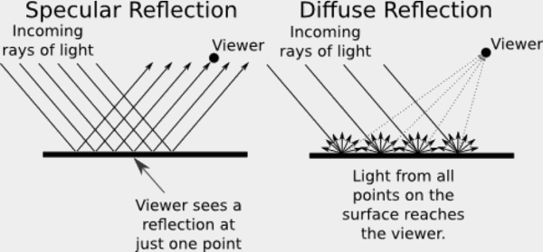
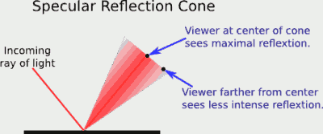

# Chapter 4  OpenGL 1.1: Light and Material

## 4.1 Introduction to Lighting

 - Lighting calculations are disabled by default in OpenGL.
 - you need to enable lighting by calling `glEnable(GL_LIGHTING)`.
    - If that's all you do, you will find that your objects are all completely black. If you want to see them, you have to turn on some lights.
 - The properties of a surface that determine how it interacts light are referred to as the **material** of the surface.  

### 4.1.1  Light and Material

 - When light strikes a surface, some of it will be reflected. 
 - In OpenGL , the complexity is approximated by two general types of reflection,  *specular reflection* and *diffuse reflection*.

 - In perfect specular ("mirror-like") reflection, an incoming ray of light is reflected from the surface intact(完整地).
    - The reflected ray makes the same angle with the surface as the incoming ray. 
    - A viewer can see the reflected ray only if the viewer is in exactly the right position.
    - Such reflections are referred to as  *specular highlights*.
    - In practice, we think of a ray of light as being reflected not as a single perfect ray, but as a cone of light, which can be more or less narrow.

 - Specular reflection from a very shiny surface produces very narrow cones of reflected light; specular highlights on such a material are small and sharp. 
    - A duller surface will produce wider cones of reflected light and bigger, fuzzier specular highlights.
    - In OpenGL, the material property that determines the size and sharpness of specular highlights is called *shininess*.
    - Shininess in OpenGL is a number in the range 0 to 128.  As the number increases, specular highlights get smaller. 
    - This image shows eight spheres that differ only in the value of the shininess material property: (from 0, increade by 16)
    - 

 - In pure diffuse reflection, an incoming ray of light is scattered in all directions equally.
    - A viewer would see reflected light from all points on the surface. 
    - 如果入射光是均匀的平行光，责表面看起来被均匀照亮。如果入射光以不同的角度射入，比如来自附近的灯 或者照射表面是弯曲的，那么某一点的照射强度取决于光在改点的入射角度.

 - When light strikes a surface, some of the light can be absorbed, some can be reflected diffusely, and some can be reflected specularly. 
    - The amount of reflection can be different for different wavelengths.  材质反射各种波长光的程度 各不相同，这一性质形成了 材质特有的颜色。
    - We now see that a material can have two different colors -- a *diffuse color*  and a *specular color*. 
    - The diffuse color is the basic color of the object. The specular color determines the color of specular highlights. 
    - The diffuse and specular colors can be the same; for example, this is often true for metallic surfaces.  
        - Or they can be different; for example, a plastic surface will often have white specular highlights no matter what the diffuse color.
 - OpenGL goes even further.
    - In fact, there are two more colors associated with a material. 
 - The third color is the *ambient color* of the material, which tells how the surface reflects *ambient light*.
    - Ambient light refers to a general level of illumination that does not come directly from a light source. 
    - It consists of light that has been reflected and re-reflected so many times that it is no longer coming from any particular direction. 
    - Ambient light is why shadows are not absolutely black. 
    - 事实上，环境光只是对多重反射光的现实的粗略近似，但它比完全忽略多次反射要好。
    - The ambient color of a material determines how it will reflect various wavelengths of ambient light. 
    - *Ambient color* is generally set to be the same as the *diffuse color*. 
 - The fourth color associated with a material is an *emission color*.
    - 它不是和 前面3中颜色 同一意义上的颜色。 That is, it has nothing to do with how the surface reflects light. 
    - The emission color is color that does not come from any external source, and therefore seems to be emitted by the material itself. 
    - This does not mean that the object is giving off light that will illuminate other objects, 
        - but it does mean that the object can be seen even if there is no source of light (not even ambient light). (即便没有任何光源甚至环境光，物体也能被看到)
    - The emission color is usually black; that is, the object has no emission at all.
 - Material colors can also have *alpha components*,  but in OpenGL the only one may use alpha component is *diffuse* color .
 - In the case of the red, blue, and green components of the ambient, diffuse, or specular color, the term "color" really means reflectivity. 
    - That is, the red component of a color gives the proportion of red light hitting the surface that is reflected by that surface, and similarly for green and blue.

### 4.1.2  Light Properties

 - Leaving aside ambient light, the light in an environment comes from a light source such as a lamp or the sun. 
 - In fact, a lamp and the sun are examples of two essentially different kinds of light source: 
    - *point light* and *directional light*.
 - A light can have color. 
    - In fact, in OpenGL, each light source has three colors: an ambient color, a diffuse color, and a specular color. 
 - Just as the color of a material is more properly referred to as reflectivity, color of a light is more properly referred to as **intensity** or energy.
    - More exactly, color refers to how the light's energy is distributed among different wavelengths. 
    - 真实的光线可以包含无数个不同的波长; 当波长分离时，您会得到包含连续色彩的光谱或彩虹。
 - Light as it is usually modeled on a computer contains only the three basic colors, red, green, and blue. 
 - The diffuse intensity of a light is the aspect of the light that interacts with diffuse material color, 
    - and the specular intensity of a light is what interacts with specular material color. 
 - It is common for the diffuse and specular light intensities to be the same.
 - The ambient intensity of a light works a little differently. 
    - The ambient intensity of a light in OpenGL is added to the general level of ambient light. 
    - (There can also be global ambient light, which is not associated with any of the light sources in the scene.) 
    - Ambient light interacts with the ambient color of a material, and this interaction has no dependence on the position of the light sources or viewer. 
    - So, a light doesn't have to shine on an object for the object's ambient color to be affected by the light source; 
        - the light source just has to be turned on.

 - I should emphasize again that this is all just an approximation.
    - Real light sources do not have separate ambient, diffuse, and specular colors, and some computer graphics systems model light sources using just one color.

### 4.1.3  Normal Vectors

 - The visual effect of a light shining on a surface depends on the properties of the surface and of the light. 
 - But it also depends to a great extent on the angle at which the light strikes the surface. 
    - The angle is essential to specular reflection and also affects diffuse reflection. 
 - OpenGL needs to know the direction in which the surface is facing.
    - That direction is specified by a vector that is perpendicular to the surface. 
    - Another word for "perpendicular" is "normal," and a non-zero vector that is perpendicular to a surface at a given point is called a **normal vector** to that surface. 
 - When used in lighting calculations, a normal vector must have **length equal to one**.
    - A normal vector of length one is called a **unit normal**. 
 - For proper lighting calculations in OpenGL, a unit normal must be specified for each vertex. 
 - In OpenGL, normal vectors are actually assigned only to the vertices of a *primitive*. 
    - The normal vectors at the vertices of a primitive are used to do lighting calculations for the entire primitive.
 - A normal vector at a vertex is whatever you say it is, and it does not have to be literally perpendicular to the polygon. 
    - The normal vector that you choose should depend on the object that you are trying to model.
    - 事实上，顶点一般会被多个多边形共享，这个顶点的法线 一般就会选择为 所有共享面法线的和 再 normalize的结果。
 - There is one other issue in choosing normal vectors: 
    - There are always two possible unit normal vectors at a point on a surface, *pointing in opposite directions*. 
    - A polygon in 3D has two faces, facing in opposite directions. 
    - OpenGL considers one of these to be the *front face* and the other to be the *back face*. 
        - OpenGL通过 顶点的顺序区分它们： the order of the vertices is counterclockwise when looking at the front face.
    - When specifying a normal vector for the polygon, the vector should point out of the front face of the polygon. 

### 4.1.4  The OpenGL Lighting Equation

 - What does it actually mean to say that OpenGL performs "lighting calculations"? 
    - The goal of the calculation is to produce a color, (r,g,b,a), for a point on a surface. 
    - In OpenGL 1.1, lighting calculations are actually done only at the vertices of a primitive. 
        - Colors for interior points of the primitive are obtained by interpolating the vertex colors.
 - The alpha component of the vertex color, a, is easy: It's simply the alpha component of the diffuse material color at that vertex. 
 - The calculation of r, g, and b is fairly complex and rather mathematical, and you don't necessarily need to understand it. 
    - But here is a short description of how it's done...
 - Ignoring alpha components, let's assume that 
    - components (mar,mag,mab), (mdr,mdg,mdb), (msr,msg,msb), and (mer,meg,meb)
    - the global ambient intensity is (gar,gag,gab)
    - There can be several point and directional light sources, which we refer to as light number 0, light number 1, light number 2, and so on.
 - With this setup, the red component of the vertex color will be:
    - r = mer + gar\*mar + I0,r + I1,r + I2,r + ...
    - where I0,r is the contribution to the color that comes from light number 0
    - This equation says that the emission color, mer, is simply added to others ...
    - And the contribution of global ambient light is obtained by multiplying the global ambient intensity, gar, by the material ambient color, mar. 
        - This is the mathematical way of saying that the material ambient color is the fraction of the ambient light that is reflected by the surface.
 - The terms I0,r, I1,r, and so on, represent the contribution to the final color from the various light sources in the environment. 

        

