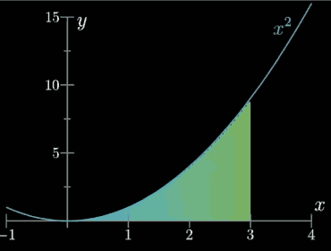
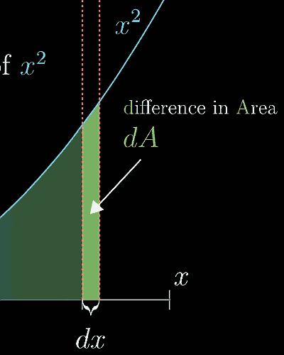

...menustart

 - [area of round](#b7e9322fc0d475861e2066642b1ecdb4)

...menuend

# chapter 1: Essense of Calculus

 - how to calculate the area of round ? 
 - hard problem -> sum of many small values -> **Area under a graph**
 - Many of these types of problems turn out be to equivalent to finding the area under some graph.

 - What's the are underneath that curve , say between the values of x=0 and x=3 ? 
 - Let's reframe this question in a slightly different way:
    - we'll fix that left endpoint in place at 0, and let the right endpoint vary.
    - Are you able to find a function A(x) that gives you the area under x² between 0 and x?
 - A function `A(x)` like this is called an integral of x².
 - Calculus holds within it the tools to figure out what an integral like this is.
 - Finding this area , this integral function , is genuinely hard. 
    - And whenever you com across a genuinely hard question in math a good policy is to not try too hard to get the answer directly, since usually you just end up banging your head against a wall. 
    - Instead , play around with the idea, with no particular goal in mind. Spend some time building up familiarity with the interplay between the function defining the graph(in this case x²)  and the function give the area. 
 - In that playful spirit , if you are lucky  , here's something that you might notice :
    - When you slightly increase x by some tiny nudge *dx* , looking that resulting change in sliver area  represented with *dA* , for a tiny difference in area. 
    - 
    - That sliver can be pretty well approximated with a rectanalge : dA ≈ x²·dx.  That is , dA/dx ≈ x².
    - When you look at 2 nearby pointer , 3 & 3.001, ( A(3.001)-A(3) )/0.001 ≈ 9. 
    - this ratio of *dA/dx* is called **derivative** of A. 
 - We care about derivatives because they help us solve problems. Thay are the key to solving integral questions, problem that finding the area under a curve. 
    - Once you gain enough familiarity with computing derivatives, you'll be able to look at a situation like this one:
        - when you don't know what a function is , but you do know that its derivative should be x².
        - and from that , reverse engineer what the function must be. 
 - And this back and forth between integrals and derivatives , where the derivative of a function for the area under a graph gives you back the function defining the graph itself is called the 
    - **Fundamental theorem of calculus**. 
    - It ties together the 2 big ideas of integrals and derivatives.  in some sense , eacho one is an inverse of the other. 

# chapter 2: Paradox of the derivatives

