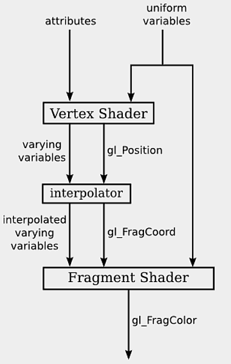

# compute graph 笔记

## openGL version

 version | feature
--- | --- 
OpenGL 1.1  | pass data in array
OpenGL 1.5  | VBO
OpenGL 2.0 | shader
GL ES 2.0  | mandatorily use shader, remove large part of OpenGL 1.1 API 
WebGL |  based on GL ES 2.0


## depth test

depth buffer (z-buffer)

## 坐标系

3个变化矩阵(model,view,project), 1个viewport转换

5个坐标系，object，world，view 右手法则，投影后的 clip，screen 左手法则


## affine transform 

```
x2 = a1*x1 + a2*y1 + a3*z1 + t1
y2 = b1*x1 + b2*y1 + b3*z1 + t2
z2 = c1*x1 + c2*y1 + c3*z1 + t3

⎡ a1 a2 a3 t1⎤ ⎡ x⎤
⎢ b1 b2 b3 t2⎥·⎢ y⎥
⎢ c1 c2 c3 t3⎥·⎢ z⎥
⎣ 0  0  0  1⎦  ⎣ 1⎦
```

perspective projection 不是 仿射变化。affine transforms preserve parallel lines。但是依然可以用4x4 矩阵表示透视投影-- 引入齐次坐标 (x,y,z,w)。 大多数情况下，不需要你直接使用齐次坐标，opengl 会处理。


## 矩阵数据存储

column-major order 

## 光照

`me + ga*ma + 各种light 的贡献 (镜面反射 漫反射 环境光)`

漫反射只和 L，N有关。  镜面反射只和 R和V 有关

光有颜色，材质也有颜色。材质的颜色其实就是对 相应光颜色的反射程度。

normal vector is at a vertex.  大多数情况下，normal vector 是共享面法线 和再normalize.

## Mipmap

大贴图 贴到一个很小的表面上，linear filtering  非常没效率，解决方案：mipmap。 mipmap会额外消耗 1/3 内存使用量.


## 计算法线矩阵

from 4x4 modelView matrix，去掉第4行，第4列，然后求 逆转置。


----


## scene graph

 - camera
    - start from camera node to get view transform at first

## shader

因为 vertex shader 和 fragment shader是分开编译的, 彼此不知道 双方 attri 和 unbiform 定义和使用上是否匹配，所以最后需要 link 才能产生一个完整的  shader program.

变量类型 | 用途,限制 | 其他
--- | --- | --- 
uniform | globally,readonly | geometric transform 只能是 uniform
attribute |  attribute 对应 vertex, 所以只能出现在 vertex shader中  | primitve coordinates 和 texture coordinates 必须是 attribute
varing | vertex/fragment 传递数据用 | 


the flow of data:




shader | default precision (int,float) | suggestion 
--- | --- | --- 
vertex |  highp, highp | 
fragment |  mediump, undefined | set float precision explicitly and globally

```
#ifdef GL_FRAGMENT_PRECISION_HIGH
    precision highp float;
#else
    precision mediump float;
#endif
```


Unlike C, function names can be overloaded.


