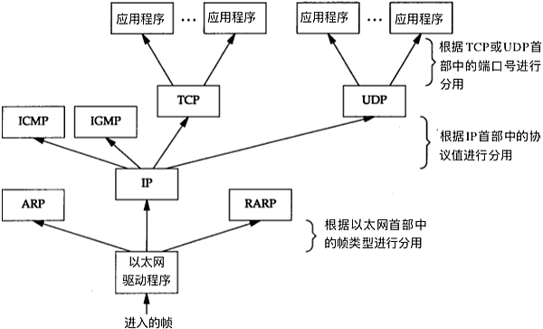
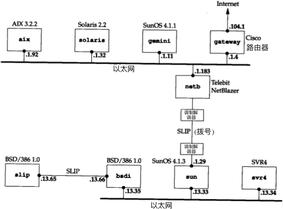
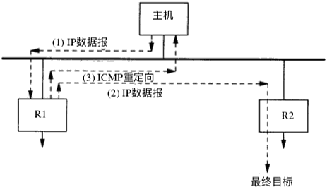
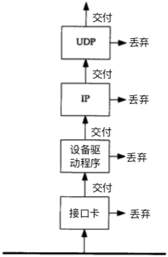

# TCP/IP 详解

## 1 概述

 - 链路层/网络层/传输层/应用层
    - 路由器是 链路层/网络层 
    - 网桥是 链路层
 - 5类ip地址
    - 0 , 128, 192, 224(多播组号), 240(待用)
 - 3类ip地址
    - 单播地址，广播地址, 多播地址
 - TCP/UDP 使用16bit 端口号区别应用程序
 - 以太网帧 分用过程
    - 
 - 本书测试网络
    - 

## 2 链路层

 - 以太网帧数据，可能是 IP数据报，也可能是 ARP,RARP 的请求/问答
 - 路径MTU, 通讯中，最重要的MTU是 两台通讯主机路径中的最小MTU

## 3 IP

 - 特性
    - unreliable: 不保证达到，出错丢弃，然后发送  ICMP消息报给 信源端
    - connectionless: 独立，可以不按发送顺序接收
 - 3.3 IP路由选择
    - 直接相连，或在一个共享网络(i.e 以太网), IP数据报直接发送到 目的主机
        - 否则， 主机把数据报发给一默认的路由器, 由路由器来转发该数据报.
    - IP层可以从TCP/UDP/ICMP/IGMP接收数据报并发送(即本地生成的数据), 或这从一个网络接口(链路层)接收并发送数据报(即 待转发的数据报)
    - IP层 在内存中有一个路由表
        - 发送时，先搜索路由表一次.
        - 当数据报来自某个网络接口时, IP首先检查 目的IP是否是 本机IP之一，或者 广播地址, 
            - 如果是，送到指定协议模块进行处理
            - 如果不是，(1)如果IP层被设置为路由器功能,则转发, 否则(2)丢弃. 
 - 路由表
    - 路由表中的每一项都包含:
        - 目的IP地址
        - 下一站路由器 (next-hop router) 的IP地址, 或者 有直接连接的网络IP地址
        - 标志
            - 其中一个标志 指明目的地IP地址是 网络地址还是主机地址.
            - 另一个标志 指明下一个路由器是否为真正的下一站路由器, 还是一个直接相连的接口
        - 为数据报的传输 指定一个网络接口
    - 数据报传输过程中，目的地IP地址不变，链路层地址 始终指向 "下一站"的链路层地址(以太网接口地址)
        - 在8.5 中 将看到，只有使用 源路由选项时， 目的IP地址才有可能被修改, 但这种情况很少出现.
        - 以太网地址通过 ARP 获得
 - 子网寻址，子网掩码 
    - 给定IP地址和子网掩码后，主机就可以确定IP数据报的目的是:
        1. 本子网上的主机
        2. 本网络中，其他子网中的主机
        3. 其他网络上的主机
    - 如果知道本机的IP地址，那么就知道踏是否为 A类，B类，C类地址(从IP地址高位可以得知), 也就知道 netid 和subnetid之间的分界线.
    - 而根据子网掩码 就可知道 subnetid与hostid 之间的分界线.
 - 3.6 特殊的IP地址
    - 0 表示所有的 bit 全为0; -1 表示 bit 全为 1 
    - subnetid 为空表示 该地址没有进行子网划分
    - 1和2 是特殊的源地址， 中间是 环回地址， 最后4个是广播地址


netid | subnetid | hostid | source | target | desc 
--- | --- | --- | --- | --- | --- 
 0 |  | 0 |  OK | N/A |  网络上的主机
 0 |  | hostid | OK | N/A | 网络上特定主机 
 127 |  | 任何值 |  Ok | OK  |  环回地址
 -1 | | -1 | N/A | OK | 受限的广播， 永远不被转发
 netid |  | -1 |  N/A | OK | 以网络为目的 向netid 广播
 netid | subnetid | -1 | N/A | OK | 以子网为目的, 向netid、subnetid 广播
 netid | -1 | -1 | N/A | OK | 以所有子网为目的，向 netid广播


 - 3.8 ifconfig
    - `SIMPLEX`: 如果接口发送一帧数据到广播地址，那么就会为本机拷贝一份数据送到 环回地址

```
en0: flags=8863<UP,BROADCAST,SMART,RUNNING,SIMPLEX,MULTICAST> mtu 1500
    options=10b<RXCSUM,TXCSUM,VLAN_HWTAGGING,AV>
    ether 3c:07:54:69:98:05
    inet6 fe80::10f5:6919:c4ae:b50a%en0 prefixlen 64 secured scopeid 0x6
    inet 10.192.81.132 netmask 0xfffff800 broadcast 10.192.87.255
    nd6 options=201<PERFORMNUD,DAD>
    media: autoselect (1000baseT <full-duplex,energy-efficient-ethernet>)
    status: active
```

 - 3.9 netstat 也提供系统上的接口信息
    - `-i` 打印接口地址 ， `-n`  打印IP地址
    - 可以看到 MTU,输入分组数, 输入错误, 输出分组数,输出错误, 冲突

```
$ netstat -in
Name  Mtu   Network       Address            Ipkts Ierrs    Opkts Oerrs  Coll
lo0   16384 <Link#1>                        318487     0   318487     0     0
lo0   16384 127           127.0.0.1         318487     -   318487     -     -
lo0   16384 ::1/128     ::1                 318487     -   318487     -     -
lo0   16384 fe80::1%lo0 fe80:1::1           318487     -   318487     -     -
gif0* 1280  <Link#2>                             0     0        0     0     0
stf0* 1280  <Link#3>                             0     0        0     0     0
EHC25 0     <Link#4>                             0     0        0     0     0
EHC25 0     <Link#5>                             0     0        0     0     0
en0   1500  <Link#6>    3c:07:54:69:98:05  4497578     0  1183548     0     0
en0   1500  fe80::10f5: fe80:6::10f5:6919  4497578     -  1183548     -     -
en0   1500  10.192.80/21  10.192.81.132    4497578     -  1183548     -     -
en1   1500  <Link#7>    7c:c3:a1:9f:4e:63    26973     0   184365     0     0
en1   1500  169.254       169.254.211.156    26973     -   184365     -     -
...
```

## 4 ARP

 - IP -> ARP -> 以太网地址　
 - ARP 广播一个ARP请求的以太网数据帧 给 每台主机.
    - 数据帧中包含 目的主机的IP地址，意思为"如果你是这个IP的owner，请回答你的硬件地址"
 - 每个主机上都有 一个ARP高速缓存 , 存放了最近 IP/硬件地址之间的映射记录。
    - 每一项的TTL一般为 20分钟。

```bash
$ arp -a
? (192.168.1.1) at d0:e:d9:9b:6d:3c on en1 ifscope [ethernet]
? (192.168.1.2) at 68:db:ca:8f:97:83 on en1 ifscope [ethernet]
? (224.0.0.251) at 1:0:5e:0:0:fb on en1 ifscope permanent [ethernet]
? (239.255.255.250) at 1:0:5e:7f:ff:fa on en1 ifscope permanent [ethernet]
```

## 6 ICMP  Internet 控制报文协议

 - 通过被认为是IP层的一个组成部分。它传递差错报文 以及其他需要注意的信息。
 - ICMP 报文 通常被IP层 或 更高层协议(TCP/UDP)使用.
 - ICMP 报文 是在IP数据报内部被传输。


## 7 ping 

 - ping 发送一份 ICMP 回显请求报文给主机 

## 8 traceroute 

 - traceroute 可以让我们看到 IP数据报从一台主机传到 另一台主机所经过的路由
 - 它发送一份 TTL 为1的IP数据报给目的主机
    - 处理这份数据报的第一个路由器将 TTL -1， 丢弃该数据报, 并发回一份超时ICMP报文。这样就得到了该路径中的第一个路由器地址。
    - 然后 再发送一份 TTL为2的报文，得到第2个路由器的地址
    - 继续这个过程，直到该数据报 到达目的主机
 - 但是 目的主机哪怕接收到TTL值为1的IP数据报，也不会丢弃该数据报 并产生一份超时ICMP报文，那么该如何判断是否已经到达目的主机了呢？
    - traceroute 发送一份UDP数据报给目的主机，但它选择一个不可能的值作为UDP端口( >30000 ), 使目的主机的任何一个应用程序都不可能使用该端口。
    - 这样traceroute 所要做的就是区分接收到的 ICMP报文是超时 还是端口不可达，以判断什么时候结束
 - IP源站选路
    - 通常IP路由是动态的。
    - source routing 的思想是由发送者指定路由.


## 9 IP选路

 - IP层工作流程
    - 
 - IP层进行的选路，实际上是一种选路机制， 它搜索路由表并决定向哪个网络接口 发送分组。 这区别于选路策略。
    - 选路策略 只是一组 决定把哪些路由 放入路由表的规则， 一般由 路由守护程序来 提供选路策略。
 - 查看路由表 `netstat -rn`
    - 如果没有 `-n` 选项， 返回结果会混用 主机名和IP地址

```
$ netstat -r
Routing tables

Internet:
Destination        Gateway            Flags        Refs      Use   Netif Expire
default            10.192.80.1        UGSc           84     2412     en0
default            link#15            UCSI            1        0 bridge1
10.192.80/21       link#6             UCS             3        0     en0
10.192.80.1/32     link#6             UCS             3        0     en0
10.192.80.1        0:0:c:9f:f0:d1     UHLWIir        12        0     en0   1185
10.192.80.3        0:de:fb:8b:85:1    UHLWI           0        0     en0   1199
svr4               18:60:24:95:4d:f   UHLWI           0        0     en0    875
...

$ netstat -rn
Routing tables

Internet:
Destination        Gateway            Flags        Refs      Use   Netif Expire
default            10.192.80.1        UGSc           71     2412     en0
default            link#15            UCSI            1        0 bridge1
10.192.80/21       link#6             UCS             4        0     en0
10.192.80.1/32     link#6             UCS             3        0     en0
10.192.80.1        0:0:c:9f:f0:d1     UHLWIir        16        0     en0   1187
10.192.80.3        0:de:fb:8b:85:1    UHLWI           0        0     en0   1198
10.192.81.84       18:60:24:95:4d:f   UHLWI           0        0     en0    862
....
```

 - 路由表条目解读：如果IP目的地 == 'Destination' ,  那么 网关(路由器)将把分组转发给 'Gateway' 
 - Flags:
    - U: 该路由可用
    - G: 该路由是一个网关(路由器)
        - 非常重要, 它区分了 间接路由和直接路由(直接路由不会设置G)
        - 发往 直接路由的分组 , 带 目的地的链路层地址; 而发往 间接路由的，链路层地址指向 网关(即下一站路由器)
    - H: 该路由是一个主机
        - 如果没有设置H，表明 说明目的地地址是一个网络地址.
        - 当为 某个目的IP地址 搜索路由表时，主机地址必须与目的地地址 完全匹配； 而网络地址只需要匹配网络号.
    - D: 该路由 是由 重定向报文创建的 (9.5)
    - M: 该路由 已被 重定向报文 修改  (9.5)
 - Refs
    - 引用计数 , 正在使用 该路由的 活动进程个数。
 - Use
    - 通过该路由 发送的分组数
 - 9.5 ICMP 重定向差错
    - 当IP数据报 应该被发送到另一个路由器时，收到数据报的路由器 就要发送 ICMP 重定向差错报文 给 IP数据报的发送端。
    - 
    - 重定向一般用来 让具有很少选路信息的主机，逐渐建立更完善的路由表。
 - 路由器操作
    - 当路由器启动时，它定期 在 所有广播或多播传送接口上 发送通告报文。 
    - 路由器还要监听来自主机的请求报文， 并发送 路由器通告 以相应这些请求报文。
    - 如果子网上有多台路由器， 由管理员为 每个路由器设置优先等级。
 - 主机操作
    - 主机引导期间， 向路由器发送 请求报文
    - 主机也监听 来自相邻路由器的通告报文， 这些通告报文 可以改变主机的默认路由器。

## 10 动态选路协议

 - 当相邻的路由器之间进行通讯，以告知对方每个路由器当前所连接的网络，这时就出现了动态选路。
    - 路由器之间 必须采用选路协议进行通讯。
 - 随着时间的变化，路由表中的信息可能会改变 -- 条目的 修改(选择最佳路由),删除(链路断开),添加等 -- 这些都是路由守护程序维护的。

## 11 UDP 用户数据报协议

 - UDP不可靠： 它把应用程序传给IP层的数据发送出去，并不保证它们能到达目的地
    - 应用程序必须关心IP数据报的长度。如果超过MTU, 那么就要对IP数据报进行分片。
 - 分片可能发生在 原始发送数据的主机上， 也可能发生在中间的路由器上
 - 把一份IP数据报分片以后，只有到达目的地才进行重新组装。
    - 重新组装由目的地的IP层来完成，对传输层是透明的。

## 12 广播和多播
 
 - 广播和多播 仅应用于 UDP， 它们对 需将报文同时传往多个接收者的应用来说十分重要。
 - 一个主机要向网上 所有的其他主机发送帧，这就是 广播。
 - 多播 multicast 介于  单播 和 广播之间: 帧仅传送给 属于多播组的多个主机。
 - 为了弄清多播和广播，需要了解 主机对由信道传送过来的帧的过滤过程
    - 首先，网卡检查 信道传送过来的帧，确定是否接收该帧： 若接收，将它传往 设备驱动程序， 否则丢弃。 
        - 通常网卡仅接收 那些目的地址为 网卡物理地址， 或 广播地址的帧。
        - 另外，多数接口 均被设置为 混合模式， 这种模式能接收每个帧的一个复制。
        - 目前，大多数的网卡经过配置 都能接收目的地址 为多播地址 或 某些子网多播地址的帧。
        - 对于以太网 ，当地址中的最高字节的最低为设置为 1时， 表示该地址是一个多播地址 : `01:00:00:00:00:00`
            - 以太网广播地址 `ff:ff:ff:ff:ff:ff` 可以看作是多播的一个特例
            - 注意，这是以太网地址，不是IP地址
    - 驱动程序进行另外的帧过滤。首先 帧类型必需要指定使用的协议(IP/ARP/...) , 其次 进行多播过滤来 检测该主机 是否属于 多播组。
        - 驱动程序将 数据帧 传送给下一层.(比如 IP数据报 传递给 IP层)
    - IP层 更具 IP地址中的源/目的 地址， 进行更多的过滤检测。 
        - 如正常，传递给下一层。(如 TCP/UDP )
    - 每次TCP/UDP 收到由 IP传送来的数据报， 就根据目的端口号，有时还有源端口号 进行数据报过滤。
        - 如果当前没有进程使用该目的端口号， 就丢弃该数据，产生一个不可达 ICPM.
        - 如果 数据报存在 校验错误，丢弃。

    - 
 - 使用广播的问题 在于它增加了对广播数据不感兴趣的主机的处理负荷。 一直到 TCP/UDP层，这些数据帧才会被丢弃。 
    - 多播的出现，减少了对应用不感兴趣主机的处理负荷。 使用多播，主机可加入一个或多个多播组。 这样，网卡将获悉该主机属于哪个多播组，然后仅接收 主机所在多播组的那些多播帧。

 - 受限的广播地址
    - `255.255.255.255` 是受限广播地址。 该地址用于 主机配置过程中IP数据报的目的地址。 
        - 此时，主机可能还不知道它所在网络的子网掩码， 甚至它的IP地址也不知道。
    - 在任何情况在，路由器都不转发 目的地址为 受限的广播地址的数据报， 这样的数据报 仅出现在本地网络中。
 - 指向网络的广播
    - 主机号全为1的地址。比如，A类网络广播地址为 `netid.255.255.255`
 - 指向所有子网的广播
    - 指向所有子网的广播， 也需要了解 目的网络的子网掩码， 以便 与指向网络的广播地址区分开。
    - 指向所有子网的广播地址的 子网号及主机号全为1.
    - 例如， 如果目的子网掩码为 255.255.255.0 , 那么 IP地址 128.1.255.255 是一个执行所有子网的广播地址.
        - 然而，如果网络没有划分子网， 这就是一个指向网络的广播。
        - 这种广播是陈旧过时的， 更好的方式 是使用多播，而不是 对所有子网的广播。
 - 12.4 IP多播 提供两类服务:
    - 1. 向多个目的地址传送数据.
        - 相关的应用有  交互式会议系统 向多个接收者 分发邮件或新闻。
        - 如果不采用多播，目前这些应用大多采用TCP来完成(向每个目的地址传送一份相同的数据拷贝). 然后即使使用多播，某些应用可能继续使用TCP保证可靠性。
    - 2. 客户端对服务器的请求。
        - 如 无盘工作站 需要确定启动引导服务器。 该项服务是通过广播来提供的，使用多播可降低 网络内其他主机的负担。
 - 多播 也是一种IP包，多播目的地址为 一个特殊的IP地址，即 D类地址  224.0.0.0 ~ 239.255.255.255
    - 一些多播地址被 IANA 确定为知名地址。 例如 224.0.0.1 代表 该子网内的所有系统组， 224.0.0.2 代表 该子网内的所有 路由器组. 224.0.1.1 用作网络时间协议NTP, 224.0.0.9 用作 RIP-2.
    - 由于 224.0.0.0/8 用于本地链路， 239.0.0.0/8 为私有多播地址， 所以实际可用与互联网上的多播地址是 225.0.0.0/8 ~ 238.0.0.0/8. 这个多播地址 不属于任何服务器或个人，它有点类似一个微信群号， 任何成员(多播源) 往微信群(多播IP) 发送消息(多播消息)， 这个群里的成员(多播接收者) 都会收到此消息。
    - IPTV 就是多播的应用
 - 单个物理网络的多播是简单的。  多播进程将 目的IP地址指明为 多播地址。 
    - 当把多播 扩展到 单个物理网络以外，需要通过路由器转发 多播数据时， 复杂性就增加了。 
    - 需要一个 协议 让多播路由器 了解确定 网络中遇雨确定多播组的任何一个主机。 这个协议就是 Internet 组管理协议 IGMP.

## 14 DNS

 - DNS 是一种用于 应用程序的 分布式数据库， 它提供 主机名字和IP地址之间的转换， 及有关电子邮件的选路信息。
 - 从应用的角度上看，对 DNS的访问 是通过一个 地址解析器 resolver 来完成的。
    - 在 Unix主机中， 主要是两个函数 
        - gethostbyname(3) name->IP  
        - gethostbyaddr(3)  IP->name
 - resolver 通常是应用程序的一部分， 并不像 TCP/IP协议那样是操作系统的内核。
 - 在应用程序请求 TCP打开一个连接 或使用UDP发送一个数据报之前，必需将 一个主机名 转换为一个 IP地址。 操作系统内核中的TCP/IP 协议族对于 DNS一点都不知道。
 - DNS 定义了一个 用于查询/响应的 报文格式。

```
$ host baidu.com
baidu.com has address 220.181.57.216
baidu.com has address 123.125.115.110
baidu.com mail is handled by 15 mx.n.shifen.com.
baidu.com mail is handled by 10 mx.maillb.baidu.com.
baidu.com mail is handled by 20 jpmx.baidu.com.
baidu.com mail is handled by 20 mx1.baidu.com.
baidu.com mail is handled by 20 mx50.baidu.com.
```


    


