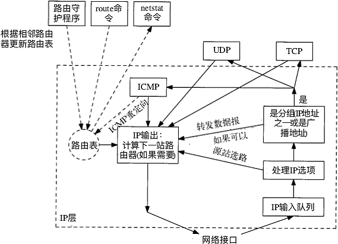

# TCP/IP 详解

## 1 概述

 - 链路层/网络层/传输层/应用层
    - 路由器是 链路层/网络层 
    - 网桥是 链路层
 - 5类ip地址
    - 0 , 128, 192, 224, 240
 - 3类ip地址
    - 单播地址，广播地址, 多播地址
 - TCP/UDP 使用16bit 端口号区别应用程序
 - 以太网帧 分用过程
    - 
 - 本书测试网络
    - 

## 2 链路层

 - 以太网帧数据，可能是 IP数据报，也可能是 ARP,RARP 的请求/问答
 - 路径MTU, 通讯中，最重要的MTU是 两台通讯主机路径中的最小MTU

## 3 IP

 - 特性
    - unreliable: 不保证达到，出错丢弃，然后发送  ICMP消息报给 信源端
    - connectionless: 独立，可以不按发送顺序接收
 - 3.3 IP路由选择
    - 直接相连，或在一个共享网络(i.e 以太网), IP数据报直接发送到 目的主机
        - 否则， 主机把数据报发给一默认的路由器, 由路由器来转发该数据报.
    - IP层可以从TCP/UDP/ICMP/IGMP接收数据报并发送(即本地生成的数据), 或这从一个网络接口(链路层)接收并发送数据报(即 待转发的数据报)
    - IP层 在内存中有一个路由表
        - 发送时，先搜索路由表一次.
        - 当数据报来自某个网络接口时, IP首先检查 目的IP是否是 本机IP之一，或者 广播地址, 
            - 如果是，送到指定协议模块进行处理
            - 如果不是，(1)如果IP层被设置为路由器功能,则转发, 否则(2)丢弃. 
 - 路由表
    - 路由表中的每一项都包含:
        - 目的IP地址
        - 下一站路由器 (next-hop router) 的IP地址, 或者 有直接连接的网络IP地址
        - 标志
            - 其中一个标志 指明目的地IP地址是 网络地址还是主机地址.
            - 另一个标志 指明下一个路由器是否为真正的下一站路由器, 还是一个直接相连的接口
        - 为数据报的传输 指定一个网络接口
    - 数据报传输过程中，目的地IP地址不变，链路层地址 始终指向 "下一站"的链路层地址(以太网接口地址)
        - 在8.5 中 将看到，只有使用 源路由选项时， 目的IP地址才有可能被修改, 但这种情况很少出现.
        - 以太网地址通过 ARP 获得
 - 子网寻址，子网掩码 
    - 给定IP地址和子网掩码后，主机就可以确定IP数据报的目的是:
        1. 本子网上的主机
        2. 本网络中，其他子网中的主机
        3. 其他网络上的主机
    - 如果知道本机的IP地址，那么就知道踏是否为 A类，B类，C类地址(从IP地址高位可以得知), 也就知道 netid 和subnetid之间的分界线.
    - 而根据子网掩码 就可知道 subnetid与hostid 之间的分界线.
 - 3.6 特殊的IP地址
    - 0 表示所有的 bit 全为0; -1 表示 bit 全为 1 
    - subnetid 为空表示 该地址没有进行子网划分
    - 1和2 是特殊的源地址， 中间是 环回地址， 最后4个是广播地址


netid | subnetid | hostid | source | target | desc 
--- | --- | --- | --- | --- | --- 
 0 |  | 0 |  OK | N/A |  网络上的主机
 0 |  | hostid | OK | N/A | 网络上特定主机 
 127 |  | 任何值 |  Ok | OK  |  环回地址
 -1 | | -1 | N/A | OK | 受限的广播， 永远不被转发
 netid |  | -1 |  N/A | OK | 以网络为目的 向netid 广播
 netid | subnetid | -1 | N/A | OK | 以子网为目的, 向netid、subnetid 广播
 netid | -1 | -1 | N/A | OK | 以所有子网为目的，向 netid广播


 - 3.8 ifconfig
    - `SIMPLEX`: 如果接口发送一帧数据到广播地址，那么就会为本机拷贝一份数据送到 环回地址

```
en0: flags=8863<UP,BROADCAST,SMART,RUNNING,SIMPLEX,MULTICAST> mtu 1500
    options=10b<RXCSUM,TXCSUM,VLAN_HWTAGGING,AV>
    ether 3c:07:54:69:98:05
    inet6 fe80::10f5:6919:c4ae:b50a%en0 prefixlen 64 secured scopeid 0x6
    inet 10.192.81.132 netmask 0xfffff800 broadcast 10.192.87.255
    nd6 options=201<PERFORMNUD,DAD>
    media: autoselect (1000baseT <full-duplex,energy-efficient-ethernet>)
    status: active
```

 - 3.9 netstat 也提供系统上的接口信息
    - `-i` 打印接口地址 ， `-n`  打印IP地址
    - 可以看到 MTU,输入分组数, 输入错误, 输出分组数,输出错误, 冲突

```
$ netstat -in
Name  Mtu   Network       Address            Ipkts Ierrs    Opkts Oerrs  Coll
lo0   16384 <Link#1>                        318487     0   318487     0     0
lo0   16384 127           127.0.0.1         318487     -   318487     -     -
lo0   16384 ::1/128     ::1                 318487     -   318487     -     -
lo0   16384 fe80::1%lo0 fe80:1::1           318487     -   318487     -     -
gif0* 1280  <Link#2>                             0     0        0     0     0
stf0* 1280  <Link#3>                             0     0        0     0     0
EHC25 0     <Link#4>                             0     0        0     0     0
EHC25 0     <Link#5>                             0     0        0     0     0
en0   1500  <Link#6>    3c:07:54:69:98:05  4497578     0  1183548     0     0
en0   1500  fe80::10f5: fe80:6::10f5:6919  4497578     -  1183548     -     -
en0   1500  10.192.80/21  10.192.81.132    4497578     -  1183548     -     -
en1   1500  <Link#7>    7c:c3:a1:9f:4e:63    26973     0   184365     0     0
en1   1500  169.254       169.254.211.156    26973     -   184365     -     -
...
```

## 4 ARP

 - IP -> ARP -> 以太网地址　
 - ARP 广播一个ARP请求的以太网数据帧 给 每台主机.
    - 数据帧中包含 目的主机的IP地址，意思为"如果你是这个IP的owner，请回答你的硬件地址"
 - 每个主机上都有 一个ARP高速缓存 , 存放了最近 IP/硬件地址之间的映射记录。
    - 每一项的TTL一般为 20分钟。

```bash
$ arp -a
? (192.168.1.1) at d0:e:d9:9b:6d:3c on en1 ifscope [ethernet]
? (192.168.1.2) at 68:db:ca:8f:97:83 on en1 ifscope [ethernet]
? (224.0.0.251) at 1:0:5e:0:0:fb on en1 ifscope permanent [ethernet]
? (239.255.255.250) at 1:0:5e:7f:ff:fa on en1 ifscope permanent [ethernet]
```

## 6 ICMP  Internet 控制报文协议

 - 通过被认为是IP层的一个组成部分。它传递差错报文 以及其他需要注意的信息。
 - ICMP 报文 通常被IP层 或 更高层协议(TCP/UDP)使用.
 - ICMP 报文 是在IP数据报内部被传输。


## 7 ping 

 - ping 发送一份 ICMP 回显请求报文给主机 

## 8 traceroute 

 - traceroute 可以让我们看到 IP数据报从一台主机传到 另一台主机所经过的路由
 - 它发送一份 TTL 为1的IP数据报给目的主机
    - 处理这份数据报的第一个路由器将 TTL -1， 丢弃该数据报, 并发回一份超时ICMP报文。这样就得到了该路径中的第一个路由器地址。
    - 然后 再发送一份 TTL为2的报文，得到第2个路由器的地址
    - 继续这个过程，直到该数据报 到达目的主机
 - 但是 目的主机哪怕接收到TTL值为1的IP数据报，也不会丢弃该数据报 并产生一份超时ICMP报文，那么该如何判断是否已经到达目的主机了呢？
    - traceroute 发送一份UDP数据报给目的主机，但它选择一个不可能的值作为UDP端口( >30000 ), 使目的主机的任何一个应用程序都不可能使用该端口。
    - 这样traceroute 所要做的就是区分接收到的 ICMP报文是超时 还是端口不可达，以判断什么时候结束
 - IP源站选路
    - 通常IP路由是动态的。
    - source routing 的思想是由发送者指定路由.


## 9 IP选路

 - IP层工作流程
    - 
 - IP层进行的选路，实际上是一种选路机制， 它搜索路由表并决定向哪个网络接口 发送分组。 这区别于选路策略。
    - 选路策略 只是一组 决定把哪些路由 放入路由表的规则， 一般由 路由守护程序来 提供选路策略。
 - 查看路由表 `netstat -rn`
    - 如果没有 `-n` 选项， 返回结果会混用 主机名和IP地址

```
$ netstat -r
Routing tables

Internet:
Destination        Gateway            Flags        Refs      Use   Netif Expire
default            10.192.80.1        UGSc           84     2412     en0
default            link#15            UCSI            1        0 bridge1
10.192.80/21       link#6             UCS             3        0     en0
10.192.80.1/32     link#6             UCS             3        0     en0
10.192.80.1        0:0:c:9f:f0:d1     UHLWIir        12        0     en0   1185
10.192.80.3        0:de:fb:8b:85:1    UHLWI           0        0     en0   1199
svr4               18:60:24:95:4d:f   UHLWI           0        0     en0    875
...

$ netstat -rn
Routing tables

Internet:
Destination        Gateway            Flags        Refs      Use   Netif Expire
default            10.192.80.1        UGSc           71     2412     en0
default            link#15            UCSI            1        0 bridge1
10.192.80/21       link#6             UCS             4        0     en0
10.192.80.1/32     link#6             UCS             3        0     en0
10.192.80.1        0:0:c:9f:f0:d1     UHLWIir        16        0     en0   1187
10.192.80.3        0:de:fb:8b:85:1    UHLWI           0        0     en0   1198
10.192.81.84       18:60:24:95:4d:f   UHLWI           0        0     en0    862
....
```

 - 路由表条目解读：如果IP目的地 == 'Destination' ,  那么 网关(路由器)将把分组转发给 'Gateway' 
 - Flags:
    - U: 该路由可用
    - G: 该路由是一个网关(路由器)
        - 非常重要, 它区分了 间接路由和直接路由(直接路由不会设置G)
        - 发往 直接路由的分组 , 带 目的地的链路层地址; 而发往 间接路由的，链路层地址指向 网关(即下一站路由器)
    - H: 该路由是一个主机
        - 如果没有设置H，表明 说明目的地地址是一个网络地址.
        - 当为 某个目的IP地址 搜索路由表时，主机地址必须与目的地地址 完全匹配； 而网络地址只需要匹配网络号.
    - D: 该路由 是由 重定向报文创建的 (9.5)
    - M: 该路由 已被 重定向报文 修改  (9.5)
 - Refs
    - 引用计数 , 正在使用 该路由的 活动进程个数。
 - Use
    - 通过该路由 发送的分组数
 - 9.5 ICMP 重定向差错
    - 当IP数据报 应该被发送到另一个路由器时，收到数据报的路由器 就要发送 ICMP 重定向差错报文 给 IP数据报的发送端。


    


